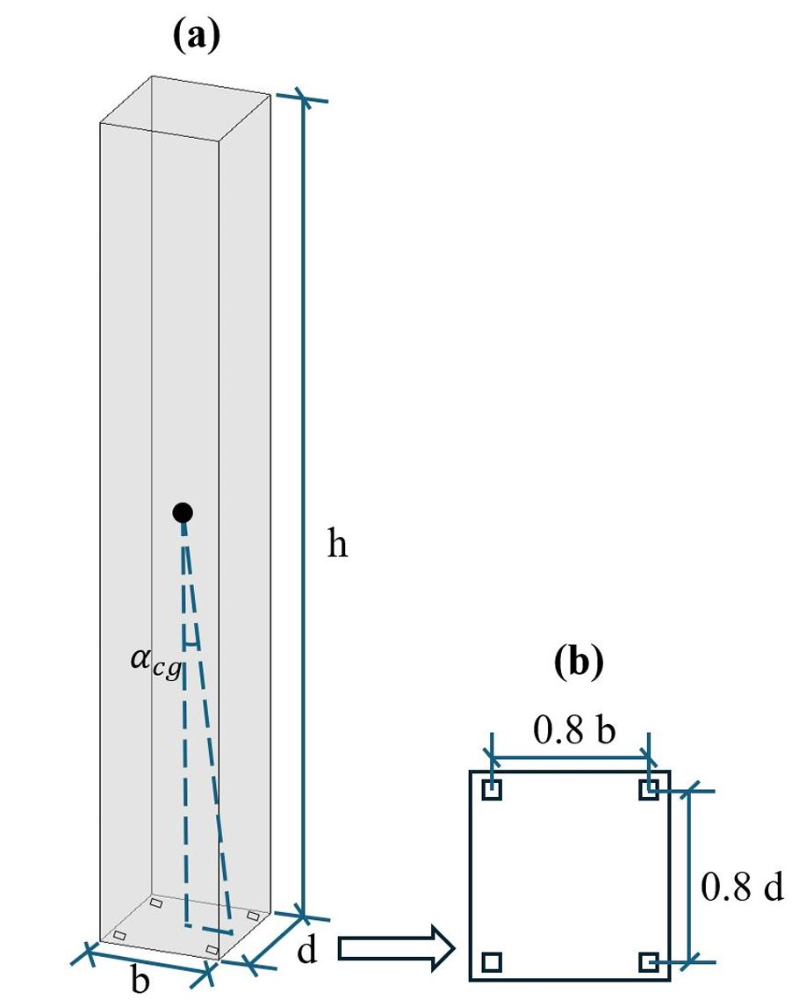
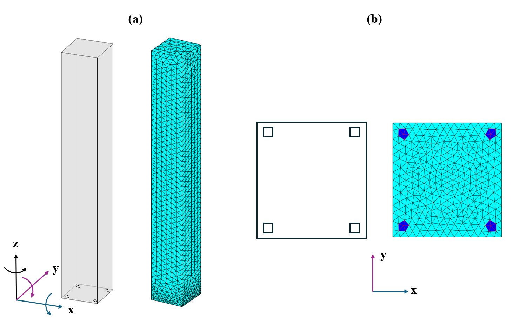
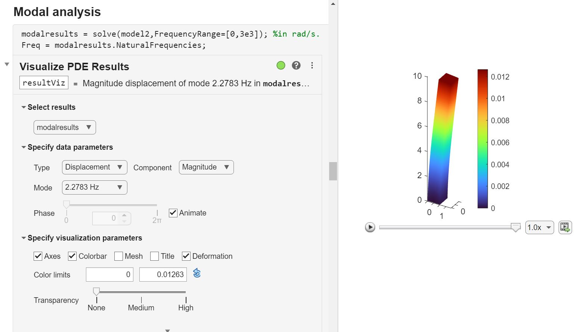
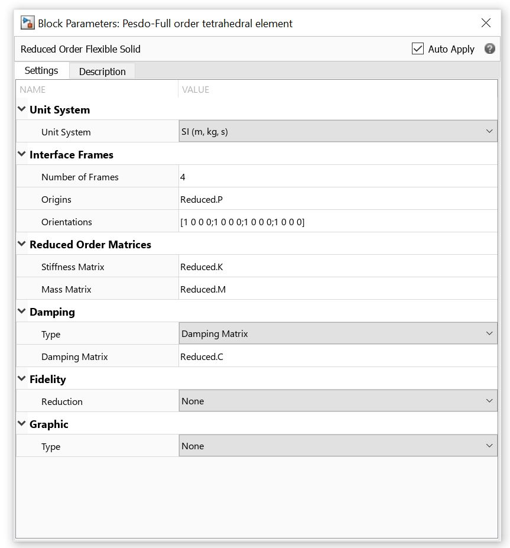

## Example 1: Rocking Column with Corner Feet

The first example models a **solid marble column** with four rigid corner feet standing on a high-grip, stiff support medium. The height of the corner feet is negligible.
This example also covers the detailed workflow, and the contents that are *not* covered by the **[Simscape Example](https://uk.mathworks.com/help/sm/ug/model-excavator-dipper-arm.html)** start with ⭐ in this document. 

**Figure 1** shows the column geometry. The column and the support media properties can be found in the companion paper.

<p align="center">

</p>

*Figure 1: (a) Schematic drawing and (b) rigid corner feet position.*


---

## 🚩 Before all
Replace the original craigBamptonImpl.m with the [modified version](./craigBamptonImpl.m). You should find the file at path like D:\MATLAB\R2023a\toolbox\pde\+pde\@StructuralModel. If you want to keep the original craigBamptonImpl.m, rename it to something else then put the [modified version](./craigBamptonImpl.m) to the same location. 

This modified Craig-Bampton implementation allows you to retain any desired fixed-interface modes, whereas the original implementation only allows to retain modes within one specific frequency range.

---


## 🚩 Step 1: Perform Craig-Bampton Reduction in MATLAB

### 1️⃣ Define structure parameters and common properties  
```matlab
% Mass in kg.
% Length in m. 
% Time in s. 

clear all
clc

NumInterFace = 4;                                           % Number of contact feet
StiModi = 1;

g = 9.80665;                                                % Gravitational acceleration
Width = 1;                                                  % Cross section width.
Depth = 1*1.05;                                             % Cross section depth.
E = 5.42538e09;                                             % Material Young's modulus in Pa.
rho = 2256.86;                                              % Material density.
nu = 0.3;                                                   % Poisson's ratio.
L = 10;                                                     % Column length.
A = Width*Depth;
ms = rho*L*A;
L_te =L;

% Global properties

distanceToEdge = 0.2;
I = ms*(Width^2+L^2)/12;
hcg = L/2;
rcg = sqrt((hcg^2) + (Width/2*(1-distanceToEdge))^2);
p = sqrt(ms*g*rcg/I);
maS = ms;                                                   % Total mass of the system.
alphacg = atan((Width/2*(1-distanceToEdge))/hcg);

% Stiffness and damping for one horizontal frictional element.

muf = 0.8;                                                  % Friction coefficient
fh = 60;                                                    % Horizontal frequency (see the paper), used to define the frictional spring stiffness.
wN=2*pi*fh;
ksin=0.5;                                                   % Frictional element damping ratio.

k_n=(maS)*wN^2/NumInterFace/StiModi;                        % Stiffnes for one frictional spring.
c_n=ksin*2*sqrt(k_n*NumInterFace*(maS))/NumInterFace;       % Damping coefficient for one frictional damper.

% Stiffness and damping for one vertical support element.

fv = 60;                                                    % Vertical frequency (see the paper), used to define the vertical spring stiffness.
wn = 2*pi*fv;
dR = 0.5;                                                   % Vertical spring damping ratio.
Ksupport_total = (wn^2)*(maS)/StiModi;
Csupport_total = dR*2*sqrt(Ksupport_total*(maS));
kk2=Ksupport_total/NumInterFace;                            % Stiffnes for one vertical spring.
cc1=Csupport_total/NumInterFace;                            % Damping coefficient for one vertical damper.

%Initial conditions

hc = 0;
zc = 1*(hc/2 - (maS)*g/(Ksupport_total));                   % Initial deformation of one vertical spring.
```
---

### 2️⃣ Generate or import the geometry  
More details about how to generate and import complex geometry can be found in the **[Simscape Example](https://uk.mathworks.com/help/sm/ug/model-excavator-dipper-arm.html)**.

```matlab
%% Generate geometry

gm = multicuboid(Width,Depth,L_te);                                                 % Generate initial geometry without additional vertices.
LF_coords = [-Width/2+distanceToEdge*Width/2;-Depth/2+distanceToEdge*Depth/2;0];    % Position of the center of the contact feet, will be added to the initial geometry as vertices.
RF_coords = [Width/2-distanceToEdge*Width/2;-Depth/2+distanceToEdge*Depth/2;0];
LB_coords = [-Width/2+distanceToEdge*Width/2;Depth/2-distanceToEdge*Depth/2;0];
RB_coords = [Width/2-distanceToEdge*Width/2;Depth/2-distanceToEdge*Depth/2;0];


RF_dis = RF_coords - LF_coords;
LB_dis = LB_coords - LF_coords;
RB_dis = RB_coords - LF_coords;


origins = [LF_coords';RF_coords';LB_coords';RB_coords'];                            % Positions of interface dofs, will be used in CB reduction.
numFrames = size(origins,1);
addVertex(gm,"Coordinates",origins);


PoI = [-Width/2 0 0.1*L_te; -Width/2 0 0.2*L_te; -Width/2 0 0.3*L_te;
    -Width/2 0 0.4*L_te; -Width/2 0 0.5*L_te;
    -Width/2 0 0.6*L_te; -Width/2 0 0.7*L_te;
    -Width/2 0 0.8*L_te; -Width/2 0 0.9*L_te;
    -Width/2 0 L_te; Width/2 0 0.1*L_te; Width/2 0 0.2*L_te;
    Width/2 0 0.3*L_te; Width/2 0 0.4*L_te;Width/2 0 0.5*L_te;Width/2 0 0.6*L_te
    Width/2 0 0.7*L_te; Width/2 0 0.8*L_te;Width/2 0 0.9*L_te;Width/2 0 L_te];      % Positions for stress investigation, will be added to the initial geometry as vertices.

for i = 1:1:size(PoI,1)                                                             % Add vertices to the initial geometry.
    addVertex(gm,"Coordinates",PoI(i,:));
end

model = createpde('structural','modal-solid');
model.Geometry = gm;

pdegplot(model,'VertexLabels','on','FaceAlpha',0.5);                                % Plot to check positions of the added vertice.

%Specify structural properties

structuralProperties(model,"YoungsModulus",E, ...
    "PoissonsRatio",nu, ...
    "MassDensity",rho);
```

---
📌Because a node in a tetrahedral element possesses only three degrees of freedom, whereas Simulink requires interface nodes to have six degrees of freedom, a multipoint kinematic constraint is necessary to construct a rigid plane with six degrees of freedom from a selected set of tetrahedral element nodes. For components with a rigid interface (as in the Simscape Example), a face-type multipoint constraint—which enforces the entire interface to behave as a single rigid plane with six degrees of freedom—is sufficient. However, in our case, only the four contact feet are rigid. Consequently, for each foot, a vertex-type multipoint constraint must be applied to couple the motion of the nodes within the foot region. The simplest approach is to add the foot vertices directly into the geometry and apply the vertex-type multipoint constraint. However, this leads to poor mesh quality in the vicinity of each foot due to their rectangular shape. 

To improve the poor mesh quality, the following strategy is used:
- Mesh the geometry without the vertices of the feet.  
- Locate the nodes closest to the foot vertices.
- Add these nodes as vertices to the original geometry to represent the foot.  
- Re-mesh the updated geometry.
- Apply vertex-type multipoint constraints.  
### 3️⃣⭐ Mesh the geometry without the vertices of the feet  

```matlab
% Create finite-element mesh

hmax = 0.2;
msh=generateMesh(model,"Hface",{1,0.06,2,0.2},Hmax=hmax,GeometricOrder="linear",Hgrad=1.2);
```

---

### 4️⃣⭐ Locate the nodes closest to the foot vertices  
```matlab
% Locate the nodes closest to the foot vertices.

nodes = msh.Nodes;
elements = msh.Elements;

LF_Node_Index = 9;
RF_Node_Index = 10;
LB_Node_Index = 11;
RB_Node_Index = 12;


ii = 1;                                                         % Find the index of the elements that include the node corresponding to the center of the LF corner.
for i = 1:1:size(msh.Elements,2)
    if sum(find (msh.Elements(:,i) == LF_Node_Index)) ~= 0
        ElemInLF(ii) = i;
        ii = ii+1;
    else
    end
end

ii = 1;                                                         % Find the index of the elements that include the node corresponding to the center of the RF corner.
for i = 1:1:size(msh.Elements,2)
    if sum(find (msh.Elements(:,i) == RF_Node_Index)) ~= 0
        ElemInRF(ii) = i;
        ii = ii+1;
    else
    end
end

ii = 1;                                                         % Find the index of the elements that include the node corresponding to the center of the LB corner.
for i = 1:1:size(msh.Elements,2)
    if sum(find (msh.Elements(:,i) == LB_Node_Index)) ~= 0
        ElemInLB(ii) = i;
        ii = ii+1;
    else
    end
end

ii = 1;                                                         % Find the index of the elements that include the node corresponding to the center of the RB corner.
for i = 1:1:size(msh.Elements,2)
    if sum(find (msh.Elements(:,i) == RB_Node_Index)) ~= 0
        ElemInRB(ii) = i;
        ii = ii+1;
    else
    end
end


Ele_link_LF_index = elements(:,ElemInLF);                        % Node index of elements that contains the reference node.
Ele_link_LF_index2 = Ele_link_LF_index(1:4,:);                   % Only include the element vertex. The others are midpoint node.
adc = unique(Ele_link_LF_index2);                                % Get rid of the repeated element vertex.
adc(find(adc == LF_Node_Index)) = [];                            % Get rid of the reference node.
LF_surroundingNodes_Index = adc(find(nodes(3,adc)==0));
LF_surroundingNodes_coords = nodes(:,LF_surroundingNodes_Index); % Find the node coordinates that is one element away from the reference node. This will be used to add vertex to the geometry in the next step.

Ele_link_RF_index = elements(:,ElemInRF);
Ele_link_RF_index2 = Ele_link_RF_index(1:4,:);
adc = unique(Ele_link_RF_index2);
adc(find(adc == RF_Node_Index)) = [];
RF_surroundingNodes_Index = adc(find(nodes(3,adc)==0));
RF_surroundingNodes_coords = nodes(:,RF_surroundingNodes_Index);

Ele_link_LB_index = elements(:,ElemInLB);
Ele_link_LB_index2 = Ele_link_LB_index(1:4,:);
adc = unique(Ele_link_LB_index2);
adc(find(adc == LB_Node_Index)) = [];
LB_surroundingNodes_Index = adc(find(nodes(3,adc)==0));
LB_surroundingNodes_coords = nodes(:,LB_surroundingNodes_Index);

Ele_link_RB_index = elements(:,ElemInRB);
Ele_link_RB_index2 = Ele_link_RB_index(1:4,:);
adc = unique(Ele_link_RB_index2);
adc(find(adc == RB_Node_Index)) = [];
RB_surroundingNodes_Index = adc(find(nodes(3,adc)==0));
RB_surroundingNodes_coords = nodes(:,RB_surroundingNodes_Index);

```
---

### 5️⃣⭐ Add these nodes as vertices to the original geometry and re-mesh
```matlab
%% Actual model we use for analysis

model2 = createpde("structural","modal-solid");
gm2 = multicuboid(Width,Depth,L_te);
addVertex(gm2,"Coordinates",origins);
addVertex(gm2,"Coordinates",[LF_surroundingNodes_coords';RF_surroundingNodes_coords';LB_surroundingNodes_coords';RB_surroundingNodes_coords']);
for i = 1:1:size(PoI,1)
    addVertex(gm2,"Coordinates",PoI(i,:));
end


model2.Geometry = gm2;
generateMesh(model2,"Hface",{1,0.06,2,0.2},Hmax=hmax,GeometricOrder="linear",Hgrad=1.2); 
structuralProperties(model2,"YoungsModulus",E, ...
    "PoissonsRatio",nu, ...
    "MassDensity",rho);
```
**Figure 2** shows the final meshed column.



*Figure 2: (a) Finite element representation of the column and (b) rigid corner feet on bottom surface shown in deep blue*

---

### 6️⃣⭐ Apply vertex-type multipoint constraints  
The six degrees of freedom of each rigid plane will be retained during Craig-Bampton reduction.

```matlab
LF_surroundingVertex_Index = [1:1:size(LF_surroundingNodes_Index,1)]+12;
RF_surroundingVertex_Index = [size(LF_surroundingNodes_Index,1)+1:1:size(RF_surroundingNodes_Index,1)+size(LF_surroundingNodes_Index,1)]+12;
LB_surroundingVertex_Index = [size(RF_surroundingNodes_Index,1)+size(LF_surroundingNodes_Index,1)+1:1:size(RF_surroundingNodes_Index,1)+size(LF_surroundingNodes_Index,1)+size(LB_surroundingNodes_Index,1)]+12;
RB_surroundingVertex_Index = [size(RF_surroundingNodes_Index,1)+size(LF_surroundingNodes_Index,1)+size(LB_surroundingNodes_Index,1)+1:1:size(RF_surroundingNodes_Index,1)+size(LF_surroundingNodes_Index,1)+size(LB_surroundingNodes_Index,1)+size(RB_surroundingNodes_Index,1)]+12;
LF_surroundingVertex_Index = [9 LF_surroundingVertex_Index];
RF_surroundingVertex_Index = [10 RF_surroundingVertex_Index];
LB_surroundingVertex_Index = [11 LB_surroundingVertex_Index];
RB_surroundingVertex_Index = [12 RB_surroundingVertex_Index];
structuralBC(model2, ...
    'Vertex',LF_surroundingVertex_Index, ...
    'Constraint','multipoint', ...
    'Reference',origins(1,:));

structuralBC(model2, ...
    'Vertex',RF_surroundingVertex_Index, ...
    'Constraint','multipoint', ...
    'Reference',origins(2,:));

structuralBC(model2, ...
    'Vertex',LB_surroundingVertex_Index, ...
    'Constraint','multipoint', ...
    'Reference',origins(3,:));

structuralBC(model2, ...
    'Vertex',RB_surroundingVertex_Index, ...
    'Constraint','multipoint', ...
    'Reference',origins(4,:));
```
---

### 7️⃣ Check the fixed-interface modes  
Take note of the frequencies corresponding to the modes you intend to retain. To determine which modes to keep, perform a convergence analysis using different numbers of modes until the results no longer change with the inclusion of additional modes.

⭐Optionally, run the modal analysis within a **live script** and use the **[visualize PDE results task](https://uk.mathworks.com/help/pde/ug/visualizepderesults.html)** to visualize the mode shapes. **Figure 3** shows the first fixed-interface mode in the PDE visualizer. 

```matlab
%% Modal analysis
modalresults = solve(model2,FrequencyRange=[0,5e3]); %in rad/s.
Freq = modalresults.NaturalFrequencies;

```


*Figure 3: Live task to visualize mode shapes.*

---

### 8️⃣ Apply Craig-Bampton reduction  
⭐List the frequency ranges corresponding to the modes you want to retain, as shown in the following code.

```matlab
%% Apply CB reduction

FreqRange = [0 Freq(20)+2;                      % Include the first 20 modes.
    Freq(24)+2 Freq(26)-2;                      % Include the 25th mode. 
    Freq(29)+2 Freq(31)-2;                      % Include the 30th mode.
    Freq(35)+2 Freq(37)-2;                      % Include the 36th mode.
    Freq(40)+2 Freq(42)-2;                      % Include the 41th mode.
    Freq(50)+2 Freq(52)-2;                      % Include the 51th mode.
    Freq(57)+2 Freq(59)-0.2];                   % Include the 58th mode.                         

R = reduce(model2,"FrequencyRange",FreqRange);  % The frequency rang is in rad/s.

Reduced.K = (R.K+R.K')/2;                       % Reduced stiffness matrix.
Reduced.M = (R.M+R.M')/2;                       % Reduced mass matrix.
Reduced.P = R.ReferenceLocations';

frmPerm = zeros(numFrames,1);                   % Frame permutation vector.
dofPerm = 1:size(Reduced.K,1);                  % DOF permutation vector.

%assert(size(Reduced.P,1) == numFrames);
for i = 1:numFrames 
    for j = 1:numFrames 
        if isequal(Reduced.P(j,:),origins(i,:))
            frmPerm(i) = j;
            dofPerm(6*(i-1)+(1:6)) = 6*(j-1)+(1:6);
            continue;
        end
    end
end

Reduced.P = Reduced.P(frmPerm,:);
Reduced.K = Reduced.K(dofPerm,:);
Reduced.K = Reduced.K(:,dofPerm);
Reduced.M = Reduced.M(dofPerm,:);
Reduced.M = Reduced.M(:,dofPerm);
```

---

### 9️⃣ Manually calculate the reduced-order damping matrix  
The following code allows assignment of different modal damping ratios to different modes. Or, Simulink’s reduced order flexible solid block can automatically compute uniform modal damping  matrix and Rayleigh damping matrix for you.  

```matlab
%% Manually calculate the reduced-order damping matrix

MoI_Length = ones(1,8);                         % Modes of interest.
MoI_Dr = 0.05;                                   % Modal damping ratio for the modes of interest.
OtherModeDr = 0.05;                              % Modal damping ratio for all other modes.
MaterialDRMatrix = [0 0 0 0 0 0 MoI_Dr*MoI_Length OtherModeDr*ones(1,length(Reduced.K)-6-length(MoI_Length))];
MaterialDRMatrix = diag(MaterialDRMatrix);

[V,D] = eig(Reduced.K,Reduced.M);
[d,sortIdxs] = sort(diag(D));
V = V(:,sortIdxs);

% Due to small numerical errors, the six eigenvalues associated with the
% rigid-body modes may not be exactly zero. To avoid numerical issues,
% check that the first six eigenvalues are close enough to zero. Then
% replace them with exact 0 values.

assert(all(abs(d(1:6))/abs(d(7)) < 1e-9),'Error due to "zero" eigenvalues.');
d(1:6) = 0;

% Vectors of generalized masses and natural frequencies

MV = Reduced.M*V;
generalizedMasses = diag(V'*MV);
naturalFrequencies = sqrt(d);

Reduced.C = MV * diag(2*MaterialDRMatrix*naturalFrequencies./generalizedMasses) * MV';
Reduced.C = (Reduced.C+Reduced.C')/2;

Reduced.C = Reduced.C(dofPerm,:);
Reduced.C = Reduced.C(:,dofPerm);             % Reduced damping matrix.
```

### 🔟⭐ Save variables needed for the full order reconstruction  
```matlab
%% Save variables needed for the full order reconstruction 

filename = 'Column-Reconstruction-26Modes.mat';
save(filename,'PoI','R','Reduced','model2');

```
---
## 🚩 Step 2: Run Simulation in Simulink

- After **Step 1**, **do not** clear anything in the MATLAB workspace.
- Open the Example_1_Simu.slx in Simulink. Check the parameters in each block, and you should find they are defined already in the MATLAB workspace. For example, **Figure 4** shows the block of the reduced order flexible solid for modelling the column, and you should find the required fields of Origins, Stiffness Matrix, Mass Matrix, and Damping Matrix are defined in variables Reduced.P, Reduced.K, Reduced.M, and Reduced.C respectively.

<p align="center">

</p>

*Figure 4: The fields in the reduced order flexible block are defined after **Step 1**.*

- Run the following code to perform simulation. 

```matlab
% Define simulation parameters

InitialOffset = 8;                                      % Initial time length of zero input excitation for the states to reach static equilibrium.                   
Cc = 8 + InitialOffset;                                 % In addition to the time length of the excitation, how long you want the simulation to run.
t_end =Cc+2*pi/omegag;                                  % Total simulation time.

freqRatio = 3;                          
omegag = p*freqRatio;                                   % Angular frequency of the input single-cylce pulse.                                       
AmpRatio = 1.2;
Ag = -AmpRatio*g*tan(alphacg);                          % Amplitude of the input single-cycle pulse.
gamma=0;                                                % Angle of attack in rads of the input single-cycle pulse.


% Solver tolerance

relTol = 1e-5;                                          % Solver relative tolerance.
absTol = 1e-5;                                          % Solver absolute tolerance.

% Start simulation 
set_param('Example_1_Simu','LoadInitialState','off')    % No initial states provided.
tic;                                                    % Start timing the simulation.
sim('Example_1_Simu.slx');                              % Run the simulink model.
toc;                                                    % Stop timing the simulation.
load('ColumnResults.mat');

% Save the simulation results
                             
filename = ['Column-Results-26Modes-' num2str(freqRatio) '-' num2str(AmpRatio) '.mat'];
save(filename,'SimulationMetadata','logsout','xout');   % Save simulation results.
```
📌Note: If you want to skip the initial time offset for reaching static equilibrium rather than running it every time, you can first run a simulation to achieve static equilibrium, save all the states then load them as the initial states in Simulink when running actual simulations. I have a code for doing this, if requested by many I will upload it.  

---

## 🚩⭐ Step 3: Reconstruct the Full Order Solutions

After running the simulation, the datasets **`logsout`** and **`xout`** contain the information required for reconstruction. The **`logsout`** dataset stores the global solution of the rigid-body reference DoFs, which is necessary for computing global displacements. The **`xout`** dataset stores the solution of all system states, including those of the reduced order flexible solid, which are required for calculating deformation, strain, and stress. To inspect the contents of each dataset, open them in MATLAB and check the `BlockPath` entries.

However, **`xout` does not include the state solution of the DoFs defining the rigid-body reference**, and this information must be added during reconstruction. The following code handles this and reconstructs the full-order stress solution.


```matlab
filename2 = ['Column-Results-26Modes-' num2str(freqRatio) '-' num2str(AmpRatio) '.mat']; 
load(filename2);                                    % Load simulation results file.

filename3 = 'Column-Reconstruction-26Modes.mat';
load(filename3);                                    % Load the reconstruction file.

Num_Interface = 4;                                  % Number of interfaces.  
t = xout{1}.Values.Time;                            % Total time steps 
PoI = [0.5 -0.366 1.008; 0.5 -0.525 0.3];           % Point of interest, as defined before. If different from the PoI in the reconstruction file, the actual positions inquired will be the node positions closest to the PoI. 
                                                                            
                                                  
% Find the node positions closest to the PoI. 

NodesCoord = model2.Mesh.Nodes;
for i = 1:1:size(PoI,1)
    NodePosition = PoI(i,:);
    XX = NodesCoord(1,:)-NodePosition(1);
    YY = NodesCoord(2,:)- NodePosition(2);
    ZZ = NodesCoord(3,:)- NodePosition(3);
    NodeIndex(i) = intersect(intersect(find(abs(XX)<0.02),find(abs(YY)<0.02)),find(abs(ZZ)<0.02));
end
NodePosition = NodesCoord(:,NodeIndex)';


% Pre-define the size of the variables. 

time = zeros(1,length(t));
StressZZ = zeros(size(PoI,1),length(time)); 
StressXX = zeros(size(PoI,1),length(time)); 
StressYY = zeros(size(PoI,1),length(time)); 
StressYZ = zeros(size(PoI,1),length(time));
StressXZ = zeros(size(PoI,1),length(time));
StressXY = zeros(size(PoI,1),length(time));
DisX = zeros(1,length(time));
DisY = zeros(1,length(time));
DisZ = zeros(1,length(time));


% Break the total time steps into number of segNum pieces, and deal with them one at a time so the
% post-processing does not consume all the ram.

segNum = 500;                                       
segment = cell(segNum,1);
startId = 1;
for i = 2:1:segNum-1
    segment{i,1} = round((length(t)-startId)*(i-1)/segNum)+startId+1:round((length(t)-startId)*i/segNum)+startId;
end
segment{1,1} = startId:round((length(t)-startId)/segNum)+startId;
segment{end,1} = round((length(t)-startId)*(segNum-1)/segNum)+startId+1:length(t);


% Reconstruction the full order solutions

for abcd = 1:1: size(segment,1)                                 % Post-process one piece of time steps during each loop.
    Interval = segment{abcd,1};
    BodyFrameSolu = zeros(size(Interval,2),6);                  % Relative displacements, velocities and accelerations of the FFR origin to itself, must be zeros for all the six DoFs.  

    interfaceDofSolu = [BodyFrameSolu xout{19}.Values.Data(Interval,1:(Num_Interface-1)*6)];    % Inferface DoFs solutions. xout{19} is the state solution of the reduced order flexible solid.
    internDofSolu =  xout{19}.Values.Data(Interval,(Num_Interface-1)*6+1:end);                  % Internal DoFs solutions.
    simSolution = [interfaceDofSolu internDofSolu];                                             

    interfaceDofSoluDot =  [BodyFrameSolu xout{20}.Values.Data(Interval,1:(Num_Interface-1)*6)];% The first derivative of the inferface DoFs solutions. xout{20} is the first derivative of the state solution of the reduced order flexible solid.
    internDofSoluDot =  xout{20}.Values.Data(Interval,(Num_Interface-1)*6+1:end);               % The first derivative of the internal DoFs solutions.                  
    simSolutionDot = [interfaceDofSoluDot internDofSoluDot];

    u = simSolution';
    ut = simSolutionDot';
    utt = zeros(size(u,1),size(u,2));                           % The second derivative of the DoFs. Not needed for reconstructing displacement and velocity solutions, but syntax requires it so all zeros with the compatible size.
    tlist = t(Interval);
    RTrom = reconstructSolution(R,u,ut,utt,tlist);              % Run the reconstruction function.


    % strain = evaluateStrain(RTrom);
    stress = evaluateStress(RTrom);                             % Evaluate the stress.
    time(1,Interval-startId+1) = tlist;
    for aq = 1:1:length(NodeIndex)
        StressZZ(aq,Interval-startId+1) = stress.zz(NodeIndex(aq),:);
        StressXX(aq,Interval-startId+1) = stress.xx(NodeIndex(aq),:);
        StressYY(aq,Interval-startId+1) = stress.yy(NodeIndex(aq),:);
        StressXY(aq,Interval-startId+1) = stress.xy(NodeIndex(aq),:);
        StressXZ(aq,Interval-startId+1) = stress.xz(NodeIndex(aq),:);
        StressYZ(aq,Interval-startId+1) = stress.yz(NodeIndex(aq),:);
    end
end

% Save the reconstruction results

filename4 = ['Column-Stress-26Modes-' num2str(freqRatio) '-' num2str(AmpRatio) '.mat']; 
save(filename4,'time','StressZZ','NodePosition','RTrom');
```


