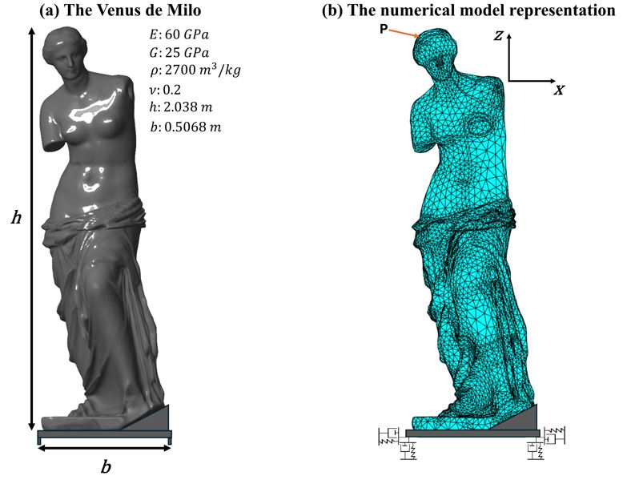
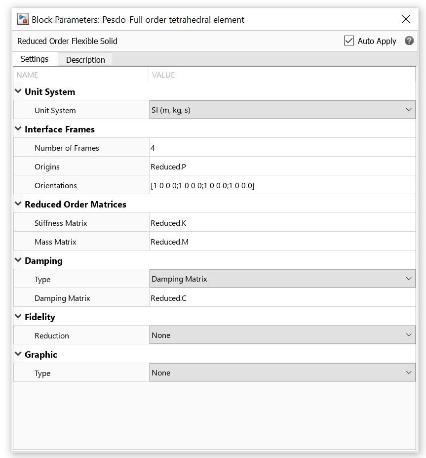

## Example 3: The rocking response of the Venus de Milo statue 

The third example models the **Venus de Milo** statue with a rigid pedestal glued to its base. The pedestal has four corner feet with negligible length standing on a marble support medium.

**Figure 1** shows the statue and its numerical model. 

<p align="center">

</p>

*Figure 1: (a) The Venus de Milo statue and (b) its corresponding full-order model.*


---

## 🚩 Before all
Replace the original craigBamptonImpl.m with the [modified version](./craigBamptonImpl.m). You should find the file at path like D:\MATLAB\R2023a\toolbox\pde\+pde\@StructuralModel. If you want to keep the original craigBamptonImpl.m, rename it to something else then put the [modified version](./craigBamptonImpl.m) to the same location. 

This modified Craig-Bampton implementation allows you to retain any desired fixed-interface modes, whereas the original implementation only allows to retain modes within one specific frequency range.

---


## 🚩 Step 1: Perform Craig-Bampton Reduction in MATLAB 
The following steps go through the [Example1_CBReduction code](Example1_Codes_and_Model/Example1_CBReduction.m) in details.

### 1️⃣ Define structure parameters and common properties  
```matlab
% Control code for the Simulink model: Venus
% Author: Zheng-You Zhang

% Mass in kg.
% Length in m. 
% Time in s. 

clear all
clc

numContact = 4;                                           % Number of contact feet

g = 9.80665;                                                % Gravitational acceleration
E = 60e09;                                                  % Material Young's modulus in Pa.
rho = 2700;                                                 % Material density.
nu = 0.2;                                                   % Poisson's ratio.
ms = 591.086;


% Global properties
maS = ms;                                             


% Support material, according to the museum website, it marble. 
v = 0.2;
Width = 2*(0.2034+0.05);
Depth = Width;
G = 25e09;
rho_support = 2700;

% Stiffness and damping for one vertical support element.
Ksupport_total = G*Width/(2*(1-v))*(3.1*(Depth/Width)^0.75+1.6);
Csupport_total = 2*sqrt(G/rho_support)*rho_support*Depth*Width;
kk2=Ksupport_total/numContact;                  %Stiffnes for one vertical element.
cc1=Csupport_total/numContact;                  %Damping for one vertical element.


% Stiffness and damping for one horizontal frictional element.
muf = 0.625;%
k_n=kk2;                                        %Stiffnes for one frictional element.
c_n=cc1;                                        %Damping for one frictional element.
                     
%Initial conditions

hc = 0;
zc = 1*(hc/2 - (maS)*g/(Ksupport_total));                   % Initial deformation of one vertical spring.

%% Generate geometry

gm = importGeometry('Venus de Milo Low Res v2.step');
s = 7.6176; 
gm = scale(gm,s);
BottomCenter = [-0.0114534, 1.05977, -0.975217];     
addVertex(gm,"Coordinates",BottomCenter)
model = createpde('structural','modal-solid');
model.Geometry = gm;


pdegplot(model,'VertexLabels','on','FaceAlpha',0.5);                                

%Specify structural properties

structuralProperties(model,"YoungsModulus",E, ...
    "PoissonsRatio",nu, ...
    "MassDensity",rho);


% Create finite-element mesh

msh=generateMesh(model,"GeometricOrder","linear","Hmin",0.02,Hmax=1);

nodeID = findNodes(msh,"nearest",BottomCenter');
origins = [msh.Nodes(1,nodeID), msh.Nodes(2,nodeID), msh.Nodes(3,nodeID)];
numFrames = size(origins,1);

structuralBC(model, ...
    'Face',[87,66,281,428,280,279], ...
    'Constraint','multipoint', ...
    'Reference',origins);


model.SolverOptions.MaxShift = 500;


%% Modal analysis
modalresults = solve(model,FrequencyRange=[0,5e4]); % in rad/s. for original Youngs, 5e4.
Freq = modalresults.NaturalFrequencies;


%% Apply CB reduction

 
FreqRange = [0 Freq(60)+0.2];  

R = reduce(model,"FrequencyRange",FreqRange);  % The frequency rang is in rad/s.

Reduced.K = (R.K+R.K')/2;                       % Reduced stiffness matrix.
Reduced.M = (R.M+R.M')/2;                       % Reduced mass matrix.
Reduced.P = R.ReferenceLocations';


%% Save the variables needed for full order resconstruction 

filename = 'Venus-Reconstruction-60Modes.mat';
save(filename,'R');


%% Define simulation parameters


                           
t_end =22;                                              % Total simulation time.                                           
relTol = 1e-4;                                          % Solver relative tolerance.
absTol = 1e-4;                                          % Solver absolute tolerance.


```
---
## 🚩 Step 2: Run Simulation in Simulink

- After **Step 1**, **do not** clear anything in the MATLAB workspace.
- Open the [Example_1_Simu.slx model](Example1_Codes_and_Model/Example_1_Simu.slx) in Simulink. Check the parameters in each block, and you should find they are defined already in the MATLAB workspace. For example, **Figure 4** shows the block of the reduced order flexible solid for modelling the column, and you should find the required fields of Origins, Stiffness Matrix, Mass Matrix, and Damping Matrix are defined in variables Reduced.P, Reduced.K, Reduced.M, and Reduced.C respectively.

<p align="center">

</p>

*Figure 4: The fields in the reduced order flexible block are defined after **Step 1**.*

- Run the following code to perform simulation. 

```matlab
% Define simulation parameters

InitialOffset = 8;                                      % Initial time length of zero input excitation for the states to reach static equilibrium.                   
Cc = 8 + InitialOffset;                                 % In addition to the time length of the excitation, how long you want the simulation to run.
t_end =Cc+2*pi/omegag;                                  % Total simulation time.

freqRatio = 3;                          
omegag = p*freqRatio;                                   % Angular frequency of the input single-cylce pulse.                                       
AmpRatio = 1.2;
Ag = -AmpRatio*g*tan(alphacg);                          % Amplitude of the input single-cycle pulse.
gamma=0;                                                % Angle of attack in rads of the input single-cycle pulse.


% Solver tolerance

relTol = 1e-5;                                          % Solver relative tolerance.
absTol = 1e-5;                                          % Solver absolute tolerance.

% Start simulation 
set_param('Example_1_Simu','LoadInitialState','off')    % No initial states provided.
tic;                                                    % Start timing the simulation.
sim('Example_1_Simu.slx');                              % Run the simulink model.
toc;                                                    % Stop timing the simulation.


% Save the simulation results
load('ColumnResults.mat');                             
filename = ['Column-Results-26Modes-' num2str(freqRatio) '-' num2str(AmpRatio) '.mat'];
save(filename,'SimulationMetadata','logsout','xout');   % Save simulation results.
```
📌Note: If you want to skip the initial time offset for reaching static equilibrium rather than running it every time, you can first run a simulation to achieve static equilibrium, save all the states then load them as the initial states in Simulink when running actual simulations. I have a code for doing this, if requested by many I will upload it.  

---

## 🚩⭐ Step 3: Reconstruct the Full Order Solutions 

After running the simulation, the datasets **`logsout`** and **`xout`** contain the information required for reconstruction. The **`logsout`** dataset stores the global solution of the rigid-body reference DoFs, which is necessary for computing full order global displacements. The **`xout`** dataset stores the solution of all system states, including those of the reduced order flexible solid, which are required for calculating full order deformation, strain, and stress. To inspect the contents of each dataset, open them in MATLAB and check the `BlockPath` entries.

However, **`xout` does not include the local state solution of the DoFs defining the rigid-body reference**, and this information must be added during reconstruction. The following [Example1_Reconstruction code](Example1_Codes_and_Model/Example1_Reconstruction.m) handles this and reconstructs the full-order stress solution.


```matlab
filename2 = ['Column-Results-26Modes-' num2str(freqRatio) '-' num2str(AmpRatio) '.mat']; 
load(filename2);                                    % Load simulation results file.

filename3 = 'Column-Reconstruction-26Modes.mat';
load(filename3);                                    % Load the reconstruction file.

Num_Interface = 4;                                  % Number of interfaces.  
t = xout{1}.Values.Time;                            % Total time steps 
PoI = [0.5 -0.366 1.008; 0.5 -0.525 0.3];           % Point of interest, as defined before. If different from the PoI in the reconstruction file, the actual positions inquired will be the node positions closest to the PoI. 
                                                                            
                                                  
% Find the node positions closest to the PoI. 

NodesCoord = model2.Mesh.Nodes;
for i = 1:1:size(PoI,1)
    NodePosition = PoI(i,:);
    XX = NodesCoord(1,:)-NodePosition(1);
    YY = NodesCoord(2,:)- NodePosition(2);
    ZZ = NodesCoord(3,:)- NodePosition(3);
    NodeIndex(i) = intersect(intersect(find(abs(XX)<0.02),find(abs(YY)<0.02)),find(abs(ZZ)<0.02));
end
NodePosition = NodesCoord(:,NodeIndex)';


% Pre-define the size of the variables. 

time = zeros(1,length(t));
StressZZ = zeros(size(PoI,1),length(time)); 
StressXX = zeros(size(PoI,1),length(time)); 
StressYY = zeros(size(PoI,1),length(time)); 
StressYZ = zeros(size(PoI,1),length(time));
StressXZ = zeros(size(PoI,1),length(time));
StressXY = zeros(size(PoI,1),length(time));
DisX = zeros(1,length(time));
DisY = zeros(1,length(time));
DisZ = zeros(1,length(time));


% Break the total time steps into number of segNum pieces, and deal with them one at a time so the
% post-processing does not consume all the ram.

segNum = 500;                                       
segment = cell(segNum,1);
startId = 1;
for i = 2:1:segNum-1
    segment{i,1} = round((length(t)-startId)*(i-1)/segNum)+startId+1:round((length(t)-startId)*i/segNum)+startId;
end
segment{1,1} = startId:round((length(t)-startId)/segNum)+startId;
segment{end,1} = round((length(t)-startId)*(segNum-1)/segNum)+startId+1:length(t);


% Reconstruct the full order solutions

for abcd = 1:1: size(segment,1)                                 % Post-process one piece of time steps during each loop.
    Interval = segment{abcd,1};
    BodyFrameSolu = zeros(size(Interval,2),6);                  % Relative displacements, velocities and accelerations of the FFR origin to itself, must be zeros for all the six DoFs.  

    interfaceDofSolu = [BodyFrameSolu xout{19}.Values.Data(Interval,1:(Num_Interface-1)*6)];    % Inferface DoFs solutions. xout{19} is the state solution of the reduced order flexible solid.
    internDofSolu =  xout{19}.Values.Data(Interval,(Num_Interface-1)*6+1:end);                  % Internal DoFs solutions.
    simSolution = [interfaceDofSolu internDofSolu];                                             

    interfaceDofSoluDot =  [BodyFrameSolu xout{20}.Values.Data(Interval,1:(Num_Interface-1)*6)];% The first derivative of the inferface DoFs solutions. xout{20} is the first derivative of the state solution of the reduced order flexible solid.
    internDofSoluDot =  xout{20}.Values.Data(Interval,(Num_Interface-1)*6+1:end);               % The first derivative of the internal DoFs solutions.                  
    simSolutionDot = [interfaceDofSoluDot internDofSoluDot];

    u = simSolution';
    ut = simSolutionDot';
    utt = zeros(size(u,1),size(u,2));                           % The second derivative of the DoFs. Not needed for reconstructing displacement and velocity solutions, but syntax requires it so all zeros with the compatible size.
    tlist = t(Interval);
    RTrom = reconstructSolution(R,u,ut,utt,tlist);              % Run the reconstruction function.


    % strain = evaluateStrain(RTrom);
    stress = evaluateStress(RTrom);                             % Evaluate the stress.
    time(1,Interval-startId+1) = tlist;
    for aq = 1:1:length(NodeIndex)
        StressZZ(aq,Interval-startId+1) = stress.zz(NodeIndex(aq),:);
        StressXX(aq,Interval-startId+1) = stress.xx(NodeIndex(aq),:);
        StressYY(aq,Interval-startId+1) = stress.yy(NodeIndex(aq),:);
        StressXY(aq,Interval-startId+1) = stress.xy(NodeIndex(aq),:);
        StressXZ(aq,Interval-startId+1) = stress.xz(NodeIndex(aq),:);
        StressYZ(aq,Interval-startId+1) = stress.yz(NodeIndex(aq),:);
    end
end

% Save the reconstruction results

filename4 = ['Column-Stress-26Modes-' num2str(freqRatio) '-' num2str(AmpRatio) '.mat']; 
save(filename4,'time','StressZZ','NodePosition','RTrom');
```


