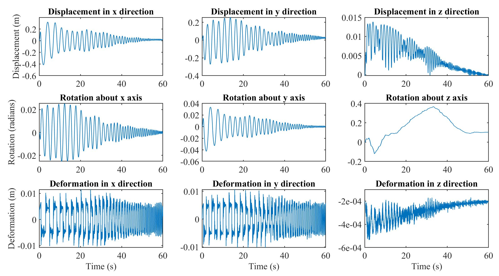

# A-accompany-code-for-the-rocking-paper
Provides the codes for the cases studied in the paper



## Time Segmentation

The script divides the simulation time vector into `segNum` equal parts.
Each segment contains the indices of `t` belonging to that range.

```matlab
segNum = 100;
segment = cell(segNum,1);

for i = 2:segNum-1
    segment{i} = round((length(t)-startId)*(i-1)/segNum) + startId : ...
                 round((length(t)-startId)*i/segNum) + startId;
end

segment{1}   = startId : round((length(t)-startId)/segNum) + startId;
segment{end} = round((length(t)-startId)*(segNum-1)/segNum)+startId : length(t);
```
fewafewa


